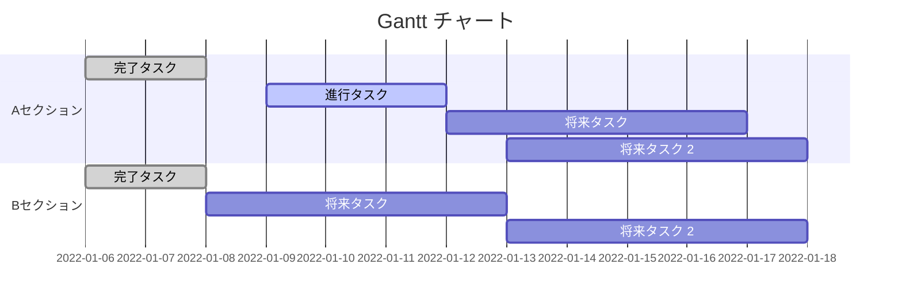
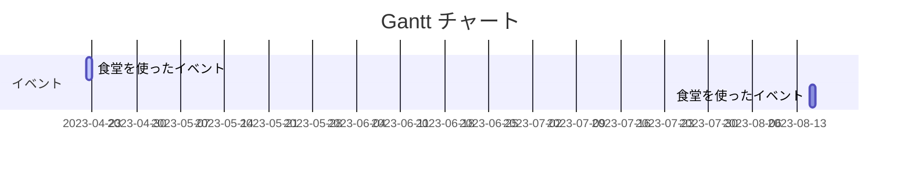
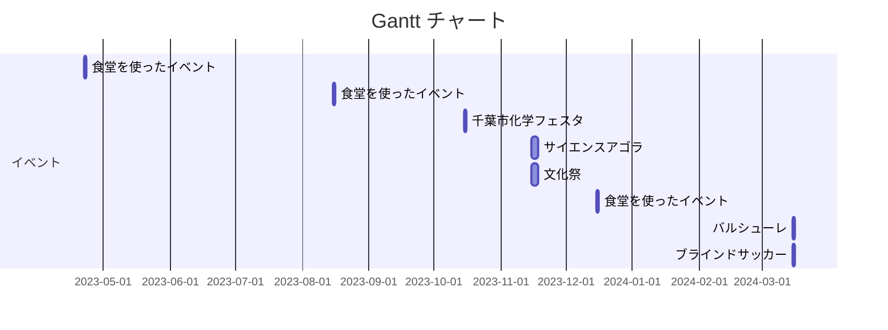
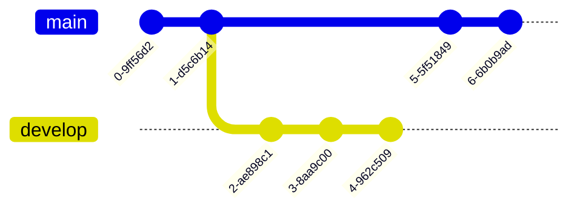

# Playground
メンバー内のテスト用

- [レの遊び場](レの遊び場.md)

```mermaid
gantt
dateFormat  YYYY-MM-DD
title Gantt チャート

section Aセクション
完了タスク            :done,    des1, 2022-01-06,2022-01-08
進行タスク            :active,  des2, 2022-01-09, 3d
将来タスク            :         des3, after des2, 5d
将来タスク 2          :         des4, after des3, 5d

section Bセクション
完了タスク           :done,    des1, 2022-01-06,2022-01-08
将来タスク           :         des3, after des1, 5d
将来タスク 2         :         des4, after des3, 5d
```

```mermaid
gantt
dateFormat  YYYY-MM-DD
title Gantt チャート

section イベント
食堂を使ったイベント :active, des1, 2023-04-22, 1d
食堂を使ったイベント :        des2, 2023-08-15, 1d
```

```mermaid
gantt
dateFormat  YYYY-MM-DD
title Gantt チャート

section イベント
食堂を使ったイベント :active, des1, 2023-04-22, 1d
食堂を使ったイベント :        des1, 2023-08-15, 1d
千葉市化学フェスタ   :        des1, 2023-10-15, 1d
サイエンスアゴラ     :        des1, 2023-11-15, 3d
文化祭               :        des1, 2023-11-15, 3d
食堂を使ったイベント :        des1, 2023-12-15, 1d
バルシューレ         :        des1, 2024-03-15, 1d
ブラインドサッカー   :        des1, 2024-03-15, 1d
```

```mermaid
gitGraph
       commit
       commit
       branch develop
       commit
       commit
       commit
       checkout main
       commit
       commit
```
