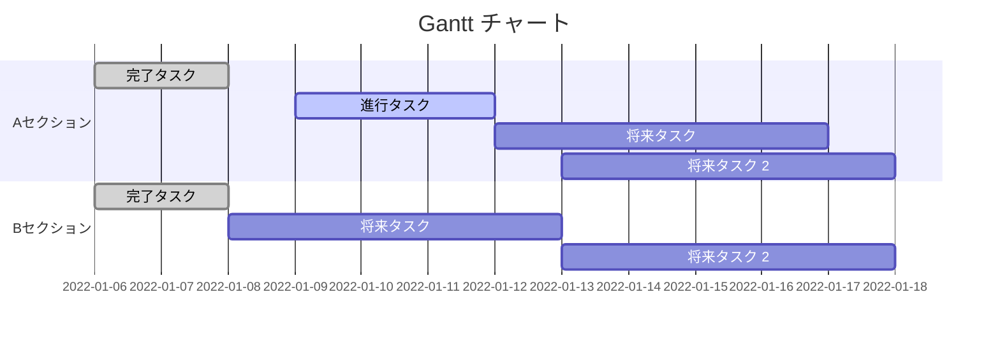

# Playground
メンバー内のテスト用

- [レの遊び場](レの遊び場.md)



```mermaid
gantt
    食堂を使ったイベント :active ,2023-04-22
    食堂を使ったイベント :active ,2023-8-15
    千葉市化学フェスタ   :active ,2023-10-15
    サイエンスアゴラ     :active ,2023-11-15
    文化祭               :active ,2023-11-15
    食堂を使ったイベント :active ,2023-12-15
    バルシューレ         :active ,2024-3-15
    ブラインドサッカー   :active ,2024-3-15
```


